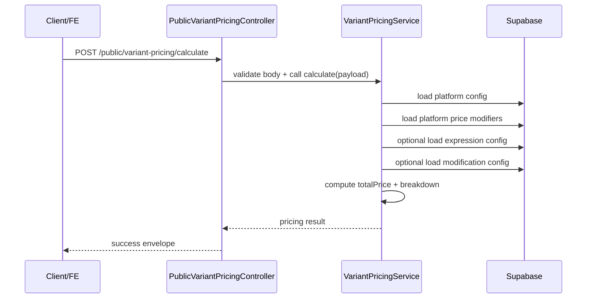

# Public API - Variant Pricing Calculate

## Tài liệu

- Phiên bản: `v1.0`
- Cập nhật: `2026-06-03`
- Endpoint: `POST /public/variant-pricing/calculate`
- Nhóm: `Public - Variant Pricing`
- Auth: `Public`

## Mục lục

- [Mục tiêu](#muc-tieu)
- [Tổng quan endpoint](#tong-quan-endpoint)
- [Headers](#headers)
- [Request body](#request-body)
- [Response thành công](#response-thanh-cong)
- [Luồng xử lý](#luong-xu-ly)
- [Quy tắc tính giá](#quy-tac-tinh-gia)
- [Ví dụ request/response](#vi-du-requestresponse)
- [Error cases](#error-cases)
- [Source of truth](#source-of-truth)

## Mục tiêu

Endpoint này dùng để tính giá bản quyền cho một biến thể sản phẩm dựa trên:

- loại nền tảng `DIGITAL` hoặc `PHYSICAL`
- config nền tảng tương ứng
- các lựa chọn `subject`, `duration`, `scope`
- config bổ sung cho `expression` và `modification`

Kết quả trả về gồm:

- `totalPrice`
- `currency`
- `breakdown[]` để FE hiển thị chi tiết từng bước tính giá

## Tổng quan endpoint

```http
POST /public/variant-pricing/calculate
Content-Type: application/json
```



## Headers

| Header                           | Bắt buộc | Mô tả                                                                  |
| -------------------------------- | -------- | ---------------------------------------------------------------------- |
| `Content-Type: application/json` | Có       | Request body dạng JSON                                                 |
| `x-request-id`                   | Không    | Client có thể gửi để trace request; nếu không có server sẽ tự generate |

## Request body

### Schema

| Field                   | Type                              | Bắt buộc  | Mô tả                                  |
| ----------------------- | --------------------------------- | --------- | -------------------------------------- |
| `platformType`          | `DIGITAL \| PHYSICAL`             | Có        | Xác định nhánh tính giá                |
| `digitalRightConfigId`  | `uuid`                            | Điều kiện | Bắt buộc khi `platformType = DIGITAL`  |
| `physicalRightConfigId` | `uuid`                            | Điều kiện | Bắt buộc khi `platformType = PHYSICAL` |
| `subject`               | `INDIVIDUAL \| ORGANIZATION`      | Không     | Lựa chọn đối tượng                     |
| `duration`              | `ONE_YEAR \| PERPETUAL`           | Không     | Lựa chọn thời hạn                      |
| `scope`                 | `SINGLE_CHANNEL \| MULTI_CHANNEL` | Không     | Lựa chọn phạm vi                       |
| `expressionConfigId`    | `uuid`                            | Không     | Config hình thức biểu hiện             |
| `modificationConfigId`  | `uuid`                            | Không     | Config mức độ biến đổi                 |

### Validation rules

- `platformType` chỉ nhận `DIGITAL` hoặc `PHYSICAL`.
- `digitalRightConfigId` và `physicalRightConfigId` phải là `UUID v4` khi được gửi.
- Nếu `platformType = DIGITAL` nhưng thiếu `digitalRightConfigId`, API trả `400`.
- Nếu `platformType = PHYSICAL` nhưng thiếu `physicalRightConfigId`, API trả `400`.
- `subject`, `duration`, `scope` là optional; nếu không gửi thì không áp dụng bước nhân tương ứng.

### Enum values

| Field      | Giá trị hợp lệ                    |
| ---------- | --------------------------------- |
| `subject`  | `INDIVIDUAL`, `ORGANIZATION`      |
| `duration` | `ONE_YEAR`, `PERPETUAL`           |
| `scope`    | `SINGLE_CHANNEL`, `MULTI_CHANNEL` |

## Response thành công

### Response envelope

Theo chuẩn toàn dự án, response thành công phải theo envelope:

```ts
type ApiSuccessResponse<TData> = {
  success: true
  statusCode: number
  data: TData
  requestId: string
  timestamp: string
}
```

### Data schema

| Field        | Type                            | Mô tả                                    |
| ------------ | ------------------------------- | ---------------------------------------- |
| `totalPrice` | `number`                        | Tổng giá cuối cùng sau tất cả multiplier |
| `currency`   | `'VND'`                         | Đơn vị tiền tệ                           |
| `breakdown`  | `VariantPricingBreakdownLine[]` | Danh sách các dòng tính giá              |

### `VariantPricingBreakdownLine`

| Field        | Type     | Mô tả                          |
| ------------ | -------- | ------------------------------ |
| `key`        | `string` | Mã định danh dòng breakdown    |
| `label`      | `string` | Nhãn hiển thị                  |

## Luồng xử lý

1. Xác định `configId` theo `platformType`.
2. Load platform config từ:
   - `digital_right_configs`, hoặc
   - `physical_right_configs`
3. Load danh sách platform price modifiers từ bảng modifier tương ứng.
4. Nếu có `expressionConfigId`, load thêm `expression_configs`.
5. Nếu có `modificationConfigId`, load thêm `modification_configs`.
6. Khởi tạo giá từ base price cố định.
7. Nhân lần lượt các hệ số theo business rules hiện tại.
8. Trả về `totalPrice`, `currency`, `breakdown`.

## Quy tắc tính giá

### Công thức tổng quát

Giá được tính theo thứ tự sau:

```text
BASE_PRICE_VND
-> platform base multiplier
-> subject fixed multiplier (nếu có)
-> duration fixed multiplier (nếu có)
-> scope fixed multiplier (nếu có)
-> platform-specific modifier cho subject/duration/scope (nếu có)
-> expression config multiplier (nếu có)
-> modification config multiplier (nếu có)
-> DIGITAL total rate 10% (chỉ áp dụng cho DIGITAL)
```

### Các hằng số hiện tại trong service

| Tên                                | Giá trị     |
| ---------------------------------- | ----------- |
| `BASE_PRICE_VND`                   | `2_530_000` |
| `DIGITAL_TOTAL_RATE`               | `0.1`       |
| `SUBJECT_MULTIPLIERS.INDIVIDUAL`   | `2.0`       |
| `SUBJECT_MULTIPLIERS.ORGANIZATION` | `2.0`       |
| `DURATION_MULTIPLIERS.ONE_YEAR`    | `2.0`       |
| `DURATION_MULTIPLIERS.PERPETUAL`   | `2.0`       |
| `SCOPE_MULTIPLIERS.SINGLE_CHANNEL` | `2.0`       |
| `SCOPE_MULTIPLIERS.MULTI_CHANNEL`  | `2.0`       |

### Lưu ý nghiệp vụ quan trọng

- `subject`, `duration`, `scope` chỉ được áp dụng khi:
  - payload có gửi giá trị tương ứng, và
  - platform modifier map có bật nhóm modifier tương ứng
- Với `subject`, `duration`, `scope`, service hiện tại có thể áp dụng theo 2 lớp:
  - fixed multiplier từ enum constants
  - platform-specific multiplier đọc từ bảng modifier
- `expressionConfigId` chỉ được áp dụng khi modifier map có key `EXPRESSION`.
- `modificationConfigId` chỉ được áp dụng khi modifier map có key `MODIFICATION`.
- Nhánh `DIGITAL` luôn nhân thêm `0.1` ở bước cuối.
- `totalPrice` được làm tròn về số nguyên VND.
- Public API không trả chi tiết tính toán nội bộ như `selected`, `multiplier`, `lineTotal` trong `breakdown`.

## Ví dụ request/response

### Ví dụ 1: DIGITAL

Request:

```json
{
  "platformType": "DIGITAL",
  "digitalRightConfigId": "31545fd4-babc-469f-b126-907c4c4aaf3b",
  "subject": "INDIVIDUAL",
  "duration": "ONE_YEAR",
  "scope": "SINGLE_CHANNEL"
}
```

Ví dụ dưới đây bám theo behavior đã được test trong service:

- `base_price_multiplier = 2`
- platform modifier chỉ có `SUBJECT_INDIVIDUAL = 3`

Response:

```json
{
  "success": true,
  "statusCode": 200,
  "data": {
    "totalPrice": 3036000,
    "currency": "VND",
    "breakdown": [
      {
        "key": "BASE_PRICE",
        "label": "Giá cơ bản bản quyền"
      },
      {
        "key": "PLATFORM_BASE_MULTIPLIER",
        "label": "Nền tảng số"
      },
      {
        "key": "SUBJECT_INDIVIDUAL",
        "label": "Đối tượng"
      },
      {
        "key": "PLATFORM_MODIFIER_SUBJECT_INDIVIDUAL",
        "label": "Yếu tố phụ thuộc (gói nền tảng)"
      },
      {
        "key": "DIGITAL_TOTAL_RATE",
        "label": "Điều chỉnh nền tảng số (10%)"
      }
    ]
  },
  "requestId": "7d0a91e0-3d20-4b23-a3df-4c859d9e52d2",
  "timestamp": "2026-06-03T08:00:00.000Z"
}
```

### Ví dụ 2: PHYSICAL với expression

Request:

```json
{
  "platformType": "PHYSICAL",
  "physicalRightConfigId": "8bbf8d2d-b24f-43a0-a7f4-f9fd1db4df18",
  "expressionConfigId": "afde17ec-9923-4e11-a853-88c2b4dbb4c1"
}
```

Ví dụ dưới đây bám theo behavior đã được test trong service:

- `base_price_multiplier = 1.5`
- `expression.price_multiplier = 2`
- không áp dụng bước `DIGITAL_TOTAL_RATE`

Response:

```json
{
  "success": true,
  "statusCode": 200,
  "data": {
    "totalPrice": 7590000,
    "currency": "VND",
    "breakdown": [
      {
        "key": "BASE_PRICE",
        "label": "Giá cơ bản bản quyền"
      },
      {
        "key": "PLATFORM_BASE_MULTIPLIER",
        "label": "Nền tảng vật lý"
      },
      {
        "key": "EXPRESSION_afde17ec-9923-4e11-a853-88c2b4dbb4c1",
        "label": "Hình thức biểu hiện"
      }
    ]
  },
  "requestId": "2dcb3614-e1df-4c92-9be0-2d1db8d4ef44",
  "timestamp": "2026-06-03T08:00:00.000Z"
}
```

## Error cases

### Error envelope

Theo chuẩn toàn dự án, response lỗi phải theo envelope:

```ts
type ApiErrorResponse = {
  success: false
  statusCode: number
  error: {
    code: string
    message: string
    details?: unknown
  }
  requestId: string
  timestamp: string
}
```

### Các lỗi chính

| Status | Error code                      | Khi nào xảy ra                                                                |
| ------ | ------------------------------- | ----------------------------------------------------------------------------- |
| `400`  | `MISSING_PLATFORM_CONFIG_ID`    | Thiếu `digitalRightConfigId` hoặc `physicalRightConfigId` theo `platformType` |
| `400`  | Validation error                | Sai enum hoặc sai format `UUID v4`                                            |
| `404`  | `PLATFORM_CONFIG_NOT_FOUND`     | Không tìm thấy config nền tảng                                                |
| `404`  | `EXPRESSION_CONFIG_NOT_FOUND`   | Có gửi `expressionConfigId` nhưng không tìm thấy config                       |
| `404`  | `MODIFICATION_CONFIG_NOT_FOUND` | Có gửi `modificationConfigId` nhưng không tìm thấy config                     |
| `500`  | Internal error                  | Lỗi khi truy vấn Supabase hoặc lỗi hệ thống nội bộ                            |

### Ví dụ lỗi thiếu platform config id

```json
{
  "success": false,
  "statusCode": 400,
  "error": {
    "code": "MISSING_PLATFORM_CONFIG_ID",
    "message": "MISSING_PLATFORM_CONFIG_ID",
    "details": {
      "platformType": "DIGITAL"
    }
  },
  "requestId": "612cd379-24bf-44da-8a0b-fd19f932f3c6",
  "timestamp": "2026-06-03T08:00:00.000Z"
}
```

### Ví dụ lỗi không tìm thấy config

```json
{
  "success": false,
  "statusCode": 404,
  "error": {
    "code": "PLATFORM_CONFIG_NOT_FOUND",
    "message": "PLATFORM_CONFIG_NOT_FOUND"
  },
  "requestId": "3ad7e91b-f65a-461a-98ef-90b4792af28d",
  "timestamp": "2026-06-03T08:00:00.000Z"
}
```

## Source of truth

- `apps/api/src/pricing/public-variant-pricing.controller.ts`
- `apps/api/src/pricing/variant-pricing.dto.ts`
- `apps/api/src/pricing/variant-pricing.enums.ts`
- `apps/api/src/pricing/variant-pricing.service.ts`
- `apps/api/src/pricing/variant-pricing.swagger.ts`
- `apps/api/src/pricing/variant-pricing.service.spec.ts`
