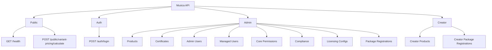

# REST API Current Reference

## Tài liệu
- Phiên bản: `v0.2-current`
- Cập nhật: `2026-06-02`
- Phạm vi: toàn bộ endpoint hiện có trong `apps/api`
- Source of truth:
  - `apps/api/openapi.json`
  - `apps/api/src/**/*.controller.ts`

## Mục tiêu
- Ghi lại **các API hiện tại** đang tồn tại trong hệ thống.
- Tách rõ nhóm `public`, `auth`, `admin`, `creator`.
- Chuẩn hóa cách đọc request/response theo envelope của `@musica/contracts`.
- Thay thế nội dung MVP cũ vốn đã không còn phản ánh đúng codebase hiện tại.

## Tổng quan


## Chuẩn chung

### Response Envelope
Mọi response phải theo envelope chuẩn:

```ts
type ApiSuccessResponse<TData, TMeta = undefined> = {
  success: true
  statusCode: number
  data: TData
  meta?: TMeta
  requestId: string
  timestamp: string
}

type ApiErrorResponse = {
  success: false
  statusCode: number
  error: {
    code: string
    message: string
    details?: unknown
  }
  requestId: string
  timestamp: string
}
```

### Pagination
- List endpoints trả `meta.pagination`.
- FE chỉ unwrap theo envelope, không đổi format response.

### Auth Matrix
- `Public`: không cần JWT
- `Authenticated`: cần Bearer token
- `ADMIN/SUPER_ADMIN`: route admin chuẩn
- `SUPER_ADMIN`: route quản trị admin accounts
- `ARTIST`: route creator

### Status Codes
- `200` đọc/cập nhật thành công
- `201` tạo mới thành công
- `400` validation hoặc business rule error
- `401` thiếu / sai JWT
- `403` sai role
- `404` không tìm thấy resource
- `409` conflict

## Public & Auth APIs

### Public
| Method | Path | Auth | Mục đích |
|---|---|---|---|
| `GET` | `/health` | Public | Health check cho deploy/runtime |
| `POST` | `/public/variant-pricing/calculate` | Public | Tính giá biến thể sản phẩm theo cấu hình gói và các thuộc tính đầu vào |

### Auth
| Method | Path | Auth | Mục đích |
|---|---|---|---|
| `POST` | `/auth/login` | Public | Đăng nhập và trả Bearer token |

### `POST /auth/login`
- Request body:
  - `email`
  - `password`
- Response data:
  - `accessToken`
  - `tokenType`
  - `expiresInSeconds`
  - `user`

### `POST /public/variant-pricing/calculate`
- Request body:
  - `platformType`: `DIGITAL | PHYSICAL`
  - `digitalRightConfigId?`
  - `physicalRightConfigId?`
  - `subject`: `INDIVIDUAL | ORGANIZATION`
  - `duration`: `ONE_YEAR | PERPETUAL`
  - `scope`: `SINGLE_CHANNEL | MULTI_CHANNEL`
  - `expressionConfigId?`
  - `modificationConfigId?`
- Response data:
  - `totalPrice`
  - `currency`
  - `breakdown[]`

## Admin APIs

### 1. Products
| Method | Path | Auth | Mục đích |
|---|---|---|---|
| `GET` | `/admin/products` | `ADMIN/SUPER_ADMIN` | List sản phẩm admin |
| `GET` | `/admin/products/summary` | `ADMIN/SUPER_ADMIN` | Summary counts cho dashboard quản lý sản phẩm |
| `POST` | `/admin/products` | `ADMIN/SUPER_ADMIN` | Tạo sản phẩm |
| `GET` | `/admin/products/{productId}` | `ADMIN/SUPER_ADMIN` | Lấy chi tiết sản phẩm |
| `PATCH` | `/admin/products/{productId}` | `ADMIN/SUPER_ADMIN` | Cập nhật metadata sản phẩm |
| `PATCH` | `/admin/products/{productId}/allowed-permissions` | `ADMIN/SUPER_ADMIN` | Cập nhật allowed core permissions |
| `POST` | `/admin/products/{productId}/original-upload-url` | `ADMIN/SUPER_ADMIN` | Lấy signed URL upload audio gốc |
| `POST` | `/admin/products/{productId}/thumbnail-upload-url` | `ADMIN/SUPER_ADMIN` | Lấy signed URL upload thumbnail |
| `POST` | `/admin/products/{productId}/sheet-music-upload-url` | `ADMIN/SUPER_ADMIN` | Lấy signed URL upload PDF khuông nhạc |
| `POST` | `/admin/products/{productId}/confirm-audio-upload` | `ADMIN/SUPER_ADMIN` | Confirm audio upload thành công |
| `POST` | `/admin/products/{productId}/confirm-thumbnail-upload` | `ADMIN/SUPER_ADMIN` | Confirm thumbnail upload thành công |
| `POST` | `/admin/products/{productId}/confirm-sheet-music-upload` | `ADMIN/SUPER_ADMIN` | Confirm PDF upload thành công |
| `GET` | `/admin/products/{productId}/thumbnail-url` | `ADMIN/SUPER_ADMIN` | Lấy signed URL xem thumbnail |
| `GET` | `/admin/products/{productId}/original-playback-url` | `ADMIN/SUPER_ADMIN` | Lấy signed playback URL cho audio |
| `GET` | `/admin/products/{productId}/sheet-music-url` | `ADMIN/SUPER_ADMIN` | Lấy signed URL mở PDF khuông nhạc |
| `PATCH` | `/admin/products/{productId}/publish` | `ADMIN/SUPER_ADMIN` | Publish sản phẩm |
| `PATCH` | `/admin/products/{productId}/hide` | `ADMIN/SUPER_ADMIN` | Hide sản phẩm |

### 2. Certificates
| Method | Path | Auth | Mục đích |
|---|---|---|---|
| `GET` | `/admin/certificates` | `ADMIN/SUPER_ADMIN` | List certificates |
| `GET` | `/admin/certificates/template` | `ADMIN/SUPER_ADMIN` | Lấy template certificate hiện tại |
| `GET` | `/admin/certificates/{certificateId}` | `ADMIN/SUPER_ADMIN` | Xem chi tiết certificate |
| `GET` | `/admin/certificates/{certificateId}/download` | `ADMIN/SUPER_ADMIN` | Lấy signed download URL PDF |
| `GET` | `/admin/certificates/{certificateId}/render-html` | `ADMIN/SUPER_ADMIN` | Render HTML preview certificate |

### 3. Admin Users
| Method | Path | Auth | Mục đích |
|---|---|---|---|
| `GET` | `/admin/users/admins` | `SUPER_ADMIN` | List tài khoản admin |
| `POST` | `/admin/users/admins` | `SUPER_ADMIN` | Tạo admin |
| `PATCH` | `/admin/users/admins/{adminId}` | `SUPER_ADMIN` | Cập nhật admin |
| `PATCH` | `/admin/users/admins/{adminId}/status` | `SUPER_ADMIN` | Đổi trạng thái admin |
| `DELETE` | `/admin/users/admins/{adminId}` | `SUPER_ADMIN` | Xóa admin |

### 4. Managed Users
| Method | Path | Auth | Mục đích |
|---|---|---|---|
| `GET` | `/admin/users` | `ADMIN/SUPER_ADMIN` | List managed users |
| `POST` | `/admin/users` | `ADMIN/SUPER_ADMIN` | Tạo user |
| `PATCH` | `/admin/users/{userId}` | `ADMIN/SUPER_ADMIN` | Cập nhật user |
| `PATCH` | `/admin/users/{userId}/status` | `ADMIN/SUPER_ADMIN` | Đổi trạng thái user |
| `DELETE` | `/admin/users/{userId}` | `ADMIN/SUPER_ADMIN` | Xóa user |

### 5. Core Permissions
| Method | Path | Auth | Mục đích |
|---|---|---|---|
| `GET` | `/admin/core-permissions` | `ADMIN/SUPER_ADMIN` | List core permissions |
| `POST` | `/admin/core-permissions` | `ADMIN/SUPER_ADMIN` | Tạo core permission |
| `PATCH` | `/admin/core-permissions/{permissionId}` | `ADMIN/SUPER_ADMIN` | Cập nhật core permission |
| `PATCH` | `/admin/core-permissions/{permissionId}/status` | `ADMIN/SUPER_ADMIN` | Đổi trạng thái core permission |
| `DELETE` | `/admin/core-permissions/{permissionId}` | `ADMIN/SUPER_ADMIN` | Xóa core permission |

### 6. Compliance
| Method | Path | Auth | Mục đích |
|---|---|---|---|
| `GET` | `/admin/compliance` | `ADMIN/SUPER_ADMIN` | List compliance records |
| `GET` | `/admin/compliance/{trackId}` | `ADMIN/SUPER_ADMIN` | Xem chi tiết compliance của product |
| `POST` | `/admin/compliance/{trackId}/files` | `ADMIN/SUPER_ADMIN` | Tạo signed upload URL cho legal/compliance files |
| `POST` | `/admin/compliance/files/download-url` | `ADMIN/SUPER_ADMIN` | Lấy signed download URL cho compliance file |
| `PUT` | `/admin/compliance/{trackId}/decision` | `ADMIN/SUPER_ADMIN` | Duyệt / từ chối compliance |

### 7. Licensing Configs

#### 7.1 Digital Right Configs
| Method | Path | Auth | Mục đích |
|---|---|---|---|
| `GET` | `/admin/digital-right-configs` | `ADMIN/SUPER_ADMIN` | List digital right configs |
| `GET` | `/admin/digital-right-configs/{configId}` | `ADMIN/SUPER_ADMIN` | Xem chi tiết 1 config |
| `POST` | `/admin/digital-right-configs` | `ADMIN/SUPER_ADMIN` | Tạo config |
| `PATCH` | `/admin/digital-right-configs/{configId}` | `ADMIN/SUPER_ADMIN` | Cập nhật config |
| `PATCH` | `/admin/digital-right-configs/{configId}/status` | `ADMIN/SUPER_ADMIN` | Publish / chuyển draft |
| `DELETE` | `/admin/digital-right-configs/{configId}` | `ADMIN/SUPER_ADMIN` | Xóa config |

#### 7.2 Physical Right Configs
| Method | Path | Auth | Mục đích |
|---|---|---|---|
| `GET` | `/admin/physical-right-configs` | `ADMIN/SUPER_ADMIN` | List physical right configs |
| `GET` | `/admin/physical-right-configs/{configId}` | `ADMIN/SUPER_ADMIN` | Xem chi tiết 1 config |
| `POST` | `/admin/physical-right-configs` | `ADMIN/SUPER_ADMIN` | Tạo config |
| `PATCH` | `/admin/physical-right-configs/{configId}` | `ADMIN/SUPER_ADMIN` | Cập nhật config |
| `PATCH` | `/admin/physical-right-configs/{configId}/status` | `ADMIN/SUPER_ADMIN` | Activate / draft |
| `DELETE` | `/admin/physical-right-configs/{configId}` | `ADMIN/SUPER_ADMIN` | Xóa config |

#### 7.3 Expression Configs
| Method | Path | Auth | Mục đích |
|---|---|---|---|
| `GET` | `/admin/expression-configs` | `ADMIN/SUPER_ADMIN` | List expression configs |
| `GET` | `/admin/expression-configs/{configId}` | `ADMIN/SUPER_ADMIN` | Xem chi tiết 1 config |
| `POST` | `/admin/expression-configs` | `ADMIN/SUPER_ADMIN` | Tạo config |
| `PATCH` | `/admin/expression-configs/{configId}` | `ADMIN/SUPER_ADMIN` | Cập nhật config |
| `PATCH` | `/admin/expression-configs/{configId}/status` | `ADMIN/SUPER_ADMIN` | Đổi trạng thái |
| `DELETE` | `/admin/expression-configs/{configId}` | `ADMIN/SUPER_ADMIN` | Xóa config |

#### 7.4 Modification Configs
| Method | Path | Auth | Mục đích |
|---|---|---|---|
| `GET` | `/admin/modification-configs` | `ADMIN/SUPER_ADMIN` | List modification configs |
| `GET` | `/admin/modification-configs/{configId}` | `ADMIN/SUPER_ADMIN` | Xem chi tiết 1 config |
| `POST` | `/admin/modification-configs` | `ADMIN/SUPER_ADMIN` | Tạo config |
| `PATCH` | `/admin/modification-configs/{configId}` | `ADMIN/SUPER_ADMIN` | Cập nhật config |
| `PATCH` | `/admin/modification-configs/{configId}/status` | `ADMIN/SUPER_ADMIN` | Đổi trạng thái |
| `DELETE` | `/admin/modification-configs/{configId}` | `ADMIN/SUPER_ADMIN` | Xóa config |

### 8. Package Registrations (Admin)
| Method | Path | Auth | Mục đích |
|---|---|---|---|
| `POST` | `/admin/products/{productId}/digital-right-registrations` | `ADMIN/SUPER_ADMIN` | Join product vào digital config |
| `DELETE` | `/admin/products/{productId}/digital-right-registrations/{registrationId}` | `ADMIN/SUPER_ADMIN` | Remove join digital |
| `POST` | `/admin/products/{productId}/physical-right-registrations` | `ADMIN/SUPER_ADMIN` | Join product vào physical config |
| `DELETE` | `/admin/products/{productId}/physical-right-registrations/{registrationId}` | `ADMIN/SUPER_ADMIN` | Remove join physical |
| `GET` | `/admin/digital-right-configs/{configId}/products` | `ADMIN/SUPER_ADMIN` | List products đã join digital config |
| `GET` | `/admin/physical-right-configs/{configId}/products` | `ADMIN/SUPER_ADMIN` | List products đã join physical config |

## Creator APIs
| Method | Path | Auth | Mục đích |
|---|---|---|---|
| `GET` | `/creator/products` | `ARTIST` | List products của creator |
| `GET` | `/creator/products/{productId}` | `ARTIST` | Xem chi tiết product của creator |
| `POST` | `/creator/products/{productId}/digital-right-registrations` | `ARTIST` | Join product vào digital config |
| `DELETE` | `/creator/products/{productId}/digital-right-registrations/{registrationId}` | `ARTIST` | Remove join digital |
| `POST` | `/creator/products/{productId}/physical-right-registrations` | `ARTIST` | Join product vào physical config |
| `DELETE` | `/creator/products/{productId}/physical-right-registrations/{registrationId}` | `ARTIST` | Remove join physical |

## Ghi chú nghiệp vụ quan trọng

### 1. Product Upload Flow
- Audio gốc:
  1. `POST /admin/products/{productId}/original-upload-url`
  2. Upload file trực tiếp lên signed URL
  3. `POST /admin/products/{productId}/confirm-audio-upload`
- Thumbnail:
  1. `POST /admin/products/{productId}/thumbnail-upload-url`
  2. Upload file
  3. `POST /admin/products/{productId}/confirm-thumbnail-upload`
- Sheet music PDF:
  1. `POST /admin/products/{productId}/sheet-music-upload-url`
  2. Upload file
  3. `POST /admin/products/{productId}/confirm-sheet-music-upload`

### 2. Licensing Config Pricing
- `digital_right_configs` và `physical_right_configs` có:
  - `basePriceMultiplier`
  - `priceModifiers[]`
- `expression_configs` và `modification_configs` quản lý hệ số riêng.
- Public pricing API có thể dùng đồng thời:
  - config nền tảng
  - subject/duration/scope
  - expression/modification config ids

### 3. Naming Note
- Một số endpoint compliance vẫn dùng placeholder `{trackId}` trong path OpenAPI, nhưng dữ liệu nghiệp vụ hiện tại là `product`.
- Trong docs này giữ nguyên path **đúng theo endpoint hiện có** để tránh lệch contract.

## Ví dụ Response Envelope

### Success
```json
{
  "success": true,
  "statusCode": 200,
  "data": {},
  "requestId": "9f1b7c4f-6eaa-4d5f-9eb9-1f5f8ec0a001",
  "timestamp": "2026-06-02T08:00:00.000Z"
}
```

### Error
```json
{
  "success": false,
  "statusCode": 404,
  "error": {
    "code": "PRODUCT_NOT_FOUND",
    "message": "PRODUCT_NOT_FOUND"
  },
  "requestId": "9f1b7c4f-6eaa-4d5f-9eb9-1f5f8ec0a001",
  "timestamp": "2026-06-02T08:00:00.000Z"
}
```

## Quy trình cập nhật tài liệu
- Sau mỗi thay đổi API:
  1. `pnpm.cmd -C apps/api build`
  2. `pnpm.cmd -C apps/api gen:openapi`
  3. cập nhật file này nếu có thay đổi nhóm endpoint hoặc business note
- Khi cần chi tiết schema:
  - xem trực tiếp `apps/api/openapi.json`
  - hoặc Swagger runtime của backend nếu đang bật local

## Change Log
- `2026-06-02`: Viết lại tài liệu theo **API thực tế hiện tại**, bổ sung `public variant pricing`, `sheet music`, `licensing configs`, `package registrations`, `price modifiers`, `creator APIs`.
